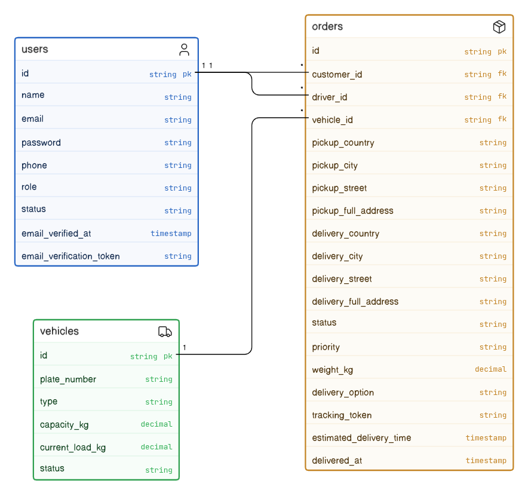
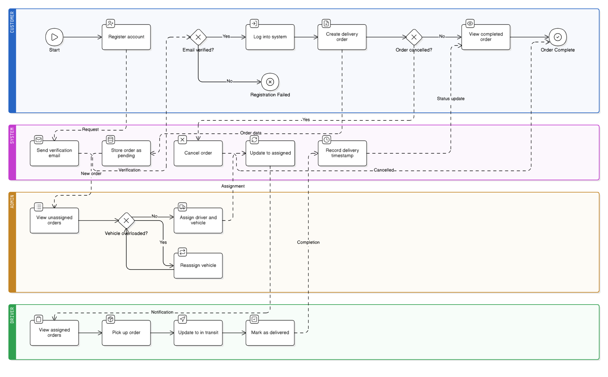

# Secure Authentication & Authorization System 

A Laravel-based backend prototype focused on secure authentication, authorization, and role-based access control using JWT and email verification.

This project demonstrates real-world backend security patterns including user authentication, email verification, role separation, and protected API design.

---

# Features

## Authentication System

- User registration (customer / driver / admin support-ready)
    
- JWT-based authentication
    
- Email verification required before login
    
- Secure login/logout system
    
- Token refresh mechanism
    
- Account status control (active, inactive, suspended)
    

## Authorization System

- Role-Based Access Control (RBAC)
    
- Middleware-protected routes per role:
    
    - Customer
        
    - Driver
        
    - Admin
        

## Order Management Prototype

- Create orders (customer only)
    
- View orders (role-based filtering)
    
- Cancel orders (only by owner)
    
- Admin assignment of drivers to orders
    
- Driver status updates
    

## Email Verification System

- Secure token-based verification
    
- Gmail SMTP integration
    
- Verification required before login
    
- Resend verification email endpoint
    

---

# Tech Stack

- Laravel (Backend Framework)
    
- PHP 8+
    
- PostgreSQL
    
- JWT Authentication (`php-open-source-saver/jwt-auth`)
    
- Gmail SMTP (Email verification)
    
- Composer
    

---

# Authentication Flow

1. User registers
    
2. System generates email verification token
    
3. Verification email is sent via Gmail SMTP
    
4. User clicks verification link
    
5. Email is verified and account is activated
    
6. User is allowed to log in
    

---

# Security Features Implemented

## Authentication Security

- JWT-based authentication
    
- Password hashing (bcrypt)
    
- Login throttling (brute-force protection)
    

## Authorization Security

- Role-based middleware protection
    
- Route-level access control
    
- Strict role validation (customer / driver / admin)
    

## Data Security

- Input validation on all requests
    
- Ownership checks (users can only access their own data)
    
- Account status enforcement (inactive users blocked)
    

## Email Security

- Token-based email verification
    
- One-time verification links
    
- Email must be verified before login
    

---

# API Endpoints

## Auth Routes

POST /api/auth/register  
POST /api/auth/login  
GET /api/auth/verify-email  
POST /api/auth/resend-verification  
GET /api/auth/me  
POST /api/auth/logout  
POST /api/auth/refresh

---

## Order Routes

POST /api/orders  
GET /api/orders  
GET /api/orders/{id}  
PATCH /api/orders/{id}/cancel

---

## Customer Routes

GET /api/customer/dashboard  
GET /api/customer/orders

---

## Driver Routes

GET /api/driver/dashboard  
GET /api/driver/orders  
PATCH /api/driver/orders/{id}/status

---

## Admin Routes

GET /api/admin/dashboard  
GET /api/admin/orders  
GET /api/admin/orders/unassigned  
PATCH /api/admin/orders/{id}/assign-driver  
GET /api/admin/drivers  
POST /api/admin/drivers  
DELETE /api/admin/drivers/{id}

---

# System Architecture

The project follows a modular REST API architecture:

- AuthController → authentication & email verification
    
- OrderController → order lifecycle management
    
- CustomerController → customer-specific access layer
    
- DriverController → driver operations
    
- AdminController → system administration
    
- Middleware → role-based access control
    

---

# Database Structure

Main entities:

- users
    
- orders
    
---

# UML Diagrams

## Use Case Diagram

## Class Diagram

## Activity Diagram

---

# Testing Flow

Recommended API testing sequence:

1. Register user
    
2. Receive email verification link
    
3. Verify email
    
4. Login
    
5. Access protected routes
    
6. Test role-based access (customer / driver / admin)
    
7. Test order creation and lifecycle
    

